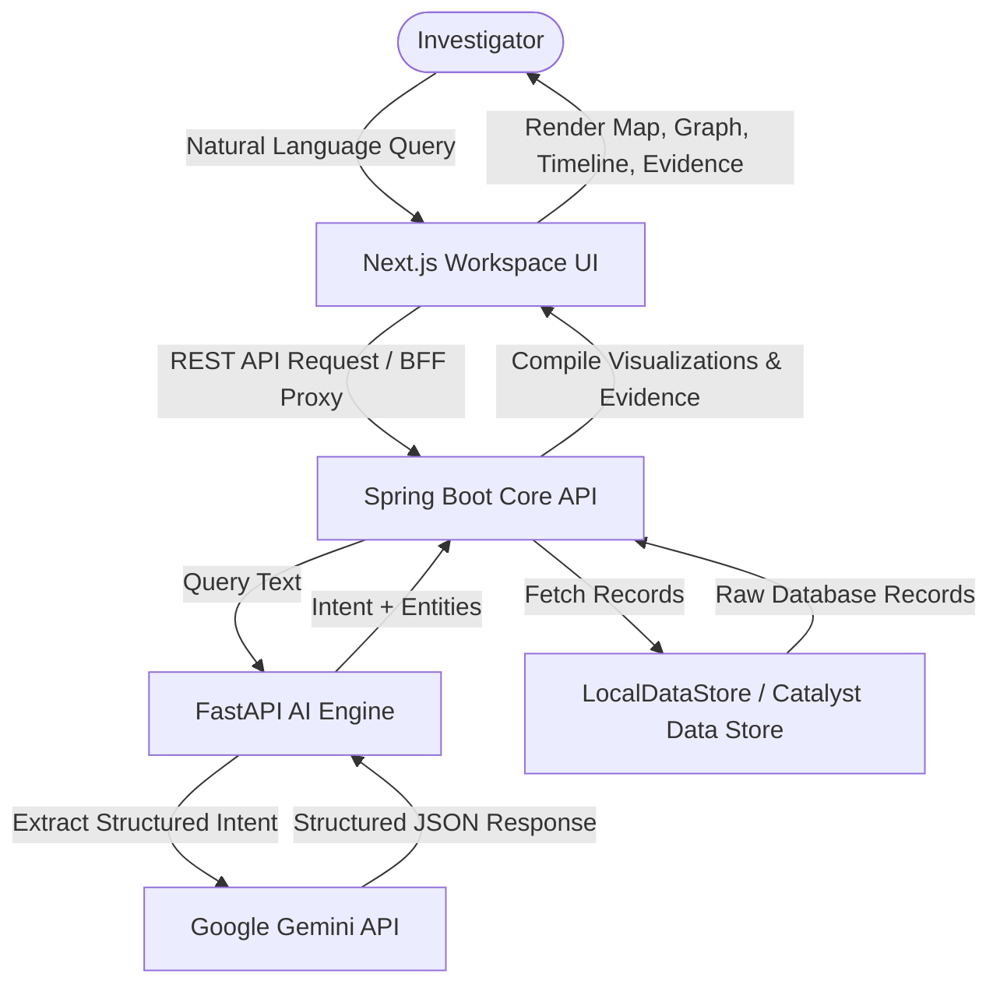
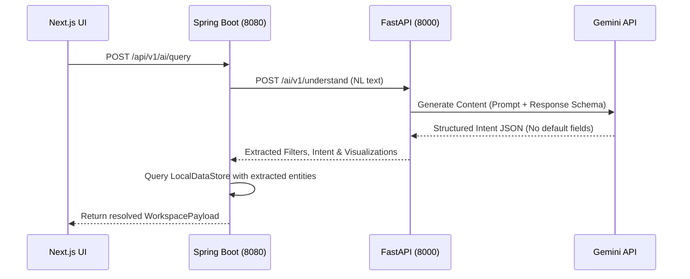

# KSP Shodhana (ಶೋಧನೆ)

> **Ask. Analyze. Act.** — AI-Powered Crime Intelligence & Investigation Workspace for the Karnataka State Police.

[](https://nextjs.org/)
[](https://spring.io/projects/spring-boot)
[](https://fastapi.tiangolo.com/)
[](https://deepmind.google/technologies/gemini/)
[](https://www.typescriptlang.org/)
[](https://openjdk.org/)
[](https://www.python.org/)

KSP Shodhana is an AI Copilot built for investigators at the Karnataka State Police. Instead of digging through legacy file vaults, fragmented Excel sheets, and disconnected FIR logs, investigators can interact with crime intelligence using natural language in both English and Kannada. The system understands query intent, processes relationships, and visually updates the workspace with crime hotspots, criminal network graphs, investigation timelines, and explainable evidence.

---

## 🖼️ Workspace Previews

### 1. Organic Landing & Onboarding
*Welcome dashboard with suggested queries, asymmetric organic cards, and a paper-grain layout.*


### 2. Crime Hotspot Heatmap
*Leaflet Positron map view highlighting geographical crime density.*


### 3. Co-Accused Network Graph
*Interactive 2D physics-based co-accused network graph centered on suspects.*


---

## 🎯 The Problem

Modern police investigators are overwhelmed by unstructured data. Standard operations require:
1. Searching manual registries across multiple local stations.
2. Manually linking accomplices by cross-referencing printed FIR files.
3. Plotting spatial crime density by drawing on physical maps.

These gaps result in delayed investigations. KSP Shodhana bridges this divide by parsing natural language and instantly structuring data into interactive spatial, relational, and temporal views.

---

## 💡 The Solution

KSP Shodhana acts as a **tactile workspace copilot** for the investigator:
* **Interactive Grid Panels**: Automatically renders maps, networks, or timelines depending on query intent.
* **Explainable Evidence**: Citations linked to official record keys and confidence indexes back up every AI claim.
* **Official Dossier Export**: Instantly compiles case summaries, suspect details, and timeline logs into a print-ready report matching the KSP format.

---

## 🛠️ Technology Stack

| Layer | Component / Library | Version | Purpose |
|---|---|---|---|
| **Frontend** | Next.js (App Router) | 16.2.10 | Workspace Frontend Application |
| **Backend** | Spring Boot | 3.3.0 | Central Orchestrator & REST APIs |
| **AI Service** | FastAPI + Python | 0.115.0 | Gemini Structured Extraction Gateway |
| **Database** | Zoho Catalyst Data Store | - | Production cloud-ready persistence layer |
| **Local Cache** | LocalDataStore (JSON-backed) | - | High-performance offline fallback mode |
| **Visualizations** | Leaflet / React Force Graph | 1.9.4 / 1.29 | Spatial maps & 2D physics suspect graphs |
| **Design Engine** | Tailwind CSS / shadcn/ui | v4 / - | Organic/Natural design tokens |

---

## 🏗️ System Architecture



---

## 📂 Project Directory Structure

```
ksp-shodhana/
├── frontend/                 # Next.js 16 Workspace App
│   ├── src/
│   │   ├── app/              # Router, globals, API proxy
│   │   ├── features/         # Feature components (chat, heatmap, network, timeline)
│   │   ├── lib/              # Client constants and REST client config
│   │   └── stores/           # Zustand state management
│   └── package.json
├── backend/                  # Spring Boot Core Orchestrator
│   ├── src/main/java/        # API Controllers, Repositories, Services
│   ├── src/main/resources/   # YAML configuration and Seed Data JSONs
│   └── pom.xml
├── ai-service/               # FastAPI Python AI Gateway
│   ├── app/
│   │   ├── prompts/          # Gemini System and intent parsing prompts
│   │   ├── routers/          # FastAPI REST endpoints
│   │   └── schemas/          # Pydantic validation models
│   └── requirements.txt
└── seed-data/                # Raw JSON files representing baseline database records
```

---

## 🚀 Installation & Local Startup

### 1. Prerequisites
Ensure you have the following installed locally:
* **Node.js**: `v20.0+`
* **Java SDK**: `JDK 17 to 25` (Lombok 1.18.46+ is configured for Java 25 compatibility)
* **Python**: `3.10+`
* **Maven**: `3.8+` (or system `mvn` runner)

---

### 2. Startup Instructions

Follow these steps to run all three services concurrently:

#### **Step A: Start the FastAPI AI Service (Port 8000)**
1. Navigate to the directory:
   ```bash
   cd ai-service
   ```
2. Initialize environment config:
   ```bash
   cp .env.example .env
   ```
3. Set up the virtual environment:
   ```bash
   python -m venv .venv
   # Windows:
   .venv\Scripts\pip install -r requirements.txt
   # Linux/macOS:
   .venv/bin/pip install -r requirements.txt
   ```
4. Run the Uvicorn server:
   ```bash
   # Windows:
   .venv\Scripts\uvicorn app.main:app --port 8000
   # Linux/macOS:
   .venv/bin/uvicorn app.main:app --port 8000
   ```

#### **Step B: Start the Spring Boot Backend (Port 8080)**
1. Open a new terminal and navigate to the directory:
   ```bash
   cd backend
   ```
2. Compile and run the application:
   ```bash
   mvn spring-boot:run
   ```
   *Note: On startup, `LocalDataStore` automatically imports baseline JSON files from the classpath.*

#### **Step C: Start the Next.js Workspace (Port 3000)**
1. Open a new terminal and navigate to the directory:
   ```bash
   cd frontend
   ```
2. Install Node dependencies:
   ```bash
   npm install
   ```
3. Launch the development server:
   ```bash
   npm run dev
   ```
4. Open your browser and navigate to **`http://localhost:3000`** to access the workspace.

---

## ⚙️ Environment Variables

### AI Service (`ai-service/.env`)
| Variable | Purpose | Required | Default |
|---|---|---|---|
| `GEMINI_API_KEY` | Google Gemini API Key | No (forces local offline mode if missing) | `""` |
| `GEMINI_MODEL` | Google Gemini model selection | No | `gemini-3.5-flash-lite` |
| `PORT` | FastAPI local running port | No | `8000` |
| `CORS_ORIGINS` | Allowed cross-origins | No | `["http://localhost:3000", "http://localhost:8080"]` |

---

## ⚡ API Overview

### 1. AI Routing Endpoints
* **`POST /api/v1/ai/query`** (Backend Router)
  * *Description*: Core entry point processing the investigator's natural language text.
  * *Request Payload*:
    ```json
    { "text": "show criminal network of Ravi Kumar" }
    ```
  * *Response Payload*:
    ```json
    {
      "success": true,
      "data": {
        "message": "Criminal network resolved for Ravi Kumar.",
        "activeVisualizations": ["network_graph", "evidence"],
        "networkData": { "nodes": [...], "links": [...] }
      }
    }
    ```

### 2. Core REST Endpoints
* **`GET /api/v1/crimes`**: List recent crimes with support for multi-param search filters.
* **`GET /api/v1/criminals`**: List criminal files filtering by status, risk level, or name.
* **`GET /api/v1/network/{criminalId}`**: Retrieve suspect graphs centered on a criminal.
* **`GET /api/v1/timeline/{investigationId}`**: Fetch chronological investigation events.
* **`GET /api/v1/reports/{reportId}/preview`**: Return official KSP-formatted HTML case intelligence dossier.

---

## 🤖 AI Workflow & Structured Output



---

## 💾 Offline Fallback & Demo Reliability
During live hackathon demos, network latency or API rate limits can impact performance. KSP Shodhana features a built-in **Local Heuristics Fallback**:
* If `GEMINI_API_KEY` is omitted or the connection to Gemini fails, the backend triggers the **`processQueryLocalFallback`** routine in `AiGatewayService.java`.
* It utilizes a regex helper supporting both **English and Kannada** key terms (e.g., `network`/`ಜಾಲ`, `hotspot`/`ನಕ್ಷೆ`, `timeline`/`ತನಿಖೆ`).
* It automatically structures the local mock data, ensuring a reliable demo experience.

---

## 🛡️ Security & Performance
* **No Default Values in Schema**: Pydantic models are stripped of default values in response schemas, preventing Google Gemini schema validation errors.
* **CORS Dynamic Binding**: Active origins bind to configuration parameters, preventing cross-origin blockages.
* **Optimized Graph physics**: 2D force graphs limit particles to a count of 2 with speed throttled to `0.005` to ensure smooth rendering at 60 FPS on low-power devices.

---

## ⚖️ License
Proprietary — Karnataka State Police. Created for the KSP Hackathon 2026.

