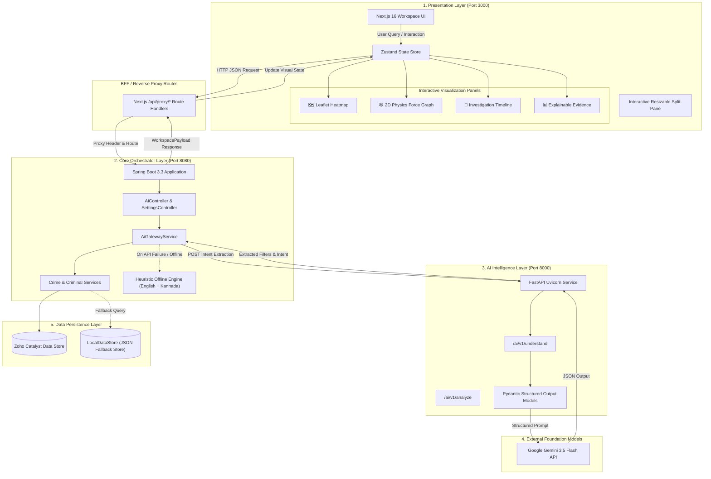
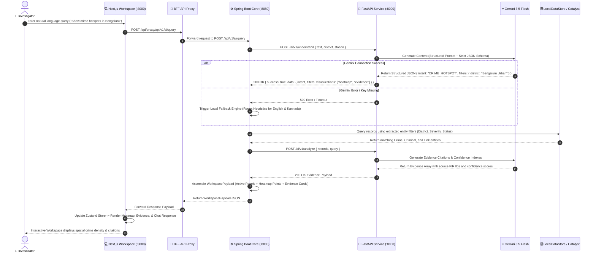

# KSP Shodhana (ಶೋಧನೆ)

> **Ask. Analyze. Act.** — AI-Powered Crime Intelligence & Investigation Workspace for the Karnataka State Police.

[](https://nextjs.org/)
[](https://spring.io/projects/spring-boot)
[](https://fastapi.tiangolo.com/)
[](https://deepmind.google/technologies/gemini/)
[](https://www.typescriptlang.org/)
[](https://openjdk.org/)
[](https://www.python.org/)
[](https://tailwindcss.com/)

---

## 📌 Executive Overview

**KSP Shodhana (ಶೋಧನೆ)** is an AI-powered intelligence workspace engineered specifically for police officers and crime investigators across Karnataka State.

Instead of navigating legacy vaults, fragmented spreadsheet registries, and disconnected FIR logs, investigators query intelligence using natural language in **English or Kannada**. The workspace autonomously parses query intent, extracts structured entities, and renders interactive spatial heatmaps, suspect co-accused network graphs, investigation timelines, and citation-backed evidence panels in real time.

---

## 🌟 Key Features

* 💬 **Multimodal AI Copilot**: Understood via Google Gemini 3.5 Flash with structured intent parsing for complex queries (`understand` & `analyze`).
* 🗺️ **Geographic Crime Density Heatmap**: Interactive Leaflet maps highlighting district-level crime hotspots, frequency clusters, and station radii.
* 🕸️ **Co-Accused Suspect Network Graph**: Interactive 2D physics-directed graph mapping suspect links, gang structures, and FIR associations.
* 📅 **Chronological Investigation Timeline**: Visual step-by-step progress tracking for active investigations and FIR events.
* 📊 **Explainable Evidence Cards**: Every AI deduction is backed by official record keys, confidence scores, and source citations.
* 🎛️ **Interactive Resizable Split-Pane**: Fluid drag-slider allowing officers to dynamically resize the Chat Box and Visualization panels.
* ⚙️ **Dynamic Settings Management**: Custom district, duty station, language, refresh interval, and local fallback toggles.
* 📄 **Official Case Dossier Preview**: One-click generation of print-ready, official KSP-formatted investigation reports.
* 🛡️ **Zero-Downtime Local Fallback Engine**: Built-in regex and keyword heuristic fallback (`English & Kannada`) ensuring reliability if external APIs are unreachable.

---

## 🛠️ Technology Stack

| Layer | Technology | Version | Purpose |
|---|---|---|---|
| **Frontend UI** | Next.js (App Router) | `16.2.10` | Interactive Workspace Web Application |
| **State Management** | Zustand | `5.0.14` | Global workspace state & panel layout control |
| **Backend Core** | Spring Boot | `3.3.0` | Orchestration API, Data Processing & Proxy Gateway |
| **AI Gateway** | FastAPI + Uvicorn | `0.115.0` | Gemini Structured Extraction & Intent Router |
| **AI Model** | Google Gemini | `3.5 Flash` | Intent understanding & analytical entity extraction |
| **Database Layer** | Zoho Catalyst Data Store | - | Production cloud-ready persistence layer |
| **Offline Data Engine** | `LocalDataStore` | JSON-backed | High-speed local seed data fallback store |
| **Maps & Graphs** | Leaflet & React Force Graph 2D | `1.9.4` / `1.29` | Spatial maps & 2D physics suspect graph rendering |
| **Design Tokens** | Tailwind CSS | `v4.0` | Modern, responsive organic palette & layout system |

---

## 🏗️ System Architecture & Data Flow

KSP Shodhana employs a **decoupled 3-tier microservice architecture** with a Backend-For-Frontend (BFF) pattern, dynamic proxy routing, structured AI intent parsing, and dual-mode resilient persistence.

### 🏛️ High-Level System Architecture



### 🔄 End-to-End Query Processing Lifecycle



### 🌊 Detailed Data Pipeline Phases

| Phase | Component | Responsibilities & Data Operations |
|---|---|---|
| **Phase 1: Ingestion & BFF Routing** | Next.js App Router | Receives natural language input from `ChatInput`, updates Zustand workspace state, and proxies requests via `/api/proxy/*` to remove CORS issues and keep backend credentials secure. |
| **Phase 2: Intent Parsing & Entity Extraction** | FastAPI + Gemini 3.5 Flash | Dispatches structured extraction prompts via Uvicorn. Validates output using Pydantic schemas (intent, action type, district/station parameters, severity, and requested visualization types). |
| **Phase 3: Resilient Fallback Router** | Spring Boot `AiGatewayService` | Monitors FastAPI response health. If Gemini API is unreachable or rate-limited, triggers a dual-language (English & Kannada) regex heuristic fallback parser, ensuring zero downtime. |
| **Phase 4: Database Query & Aggregation** | `CrimeService` & `LocalDataStore` | Executes filtered SQL/DataStore queries using the extracted entities. Retrieves FIR records, suspect co-accused links, and chronological investigation events. |
| **Phase 5: Analytical Evidence Generation** | FastAPI `/ai/v1/analyze` | Generates explainable evidence cards backed by official FIR citations, severity badges, and confidence percentages. |
| **Phase 6: Multi-Panel Client Rendering** | Leaflet + Force Graph + Zustand | Populates Leaflet maps (`heatmap`), 2D physics suspect force graphs (`network_graph`), vertical timelines (`timeline`), and resizable split-pane containers (`ChatPanel` vs `VisualizationGrid`). |

---

## 📂 Repository Structure

```
KSP-Shodhana/
├── frontend/                 # Next.js 16 Web Application
│   ├── src/
│   │   ├── app/              # App router pages, globals.css, proxy routes
│   │   ├── features/         # Chat, Heatmap, Network Graph, Timeline, Evidence
│   │   ├── lib/              # Utility functions & API clients
│   │   └── stores/           # Zustand workspace state management
│   └── package.json
├── backend/                  # Spring Boot Core Orchestrator
│   ├── src/main/java/        # REST Controllers, DTOs, Services, Data Stores
│   ├── src/main/resources/   # Application YAML & Baseline Seed Data JSONs
│   └── pom.xml
├── ai-service/               # FastAPI Python AI Service Gateway
│   ├── app/
│   │   ├── main.py           # FastAPI entry point & CORS configuration
│   │   ├── routers/          # /understand, /analyze, /settings routes
│   │   ├── schemas/          # Pydantic structured output models
│   │   └── services/         # Gemini API client & fallback handlers
│   ├── requirements.txt
│   └── .env.example
├── seed-data/                # Raw JSON datasets for baseline deployment
└── docs/                     # Architecture & system design documentation
```

---

## 🗄️ Database Schema & Data Models

The system models intelligence across 7 core entities:

| Model | Key Fields | Description |
|---|---|---|
| **Crime** | `rowId`, `firNumber`, `crimeType`, `severity`, `district`, `station`, `latitude`, `longitude` | Individual FIR incident records and spatial markers |
| **Criminal** | `rowId`, `name`, `alias`, `age`, `riskLevel`, `gangAffiliation`, `status` | Suspect dossiers and risk metrics |
| **CrimeCriminalLink** | `crimeId`, `criminalId`, `role` | Links suspect roles (*Accused*, *Suspect*, *Witness*) to FIRs |
| **CriminalNetwork** | `sourceCriminalId`, `targetCriminalId`, `relationshipType`, `strength` | Co-accused relationships and gang ties |
| **Investigation** | `investigationId`, `title`, `leadOfficer`, `status` | Active case dossier containers |
| **TimelineEvent** | `eventId`, `investigationId`, `timestamp`, `title`, `description` | Chronological event logs |
| **AuditLog** | `logId`, `timestamp`, `officerId`, `action` | Immutable security audit trails |

---

## 🚀 Local Installation & Quickstart

### Prerequisites
* **Node.js**: `v20.0+`
* **Java SDK**: `JDK 17` to `JDK 25`
* **Python**: `3.10+`
* **Maven**: `3.8+`

---

### Step 1: Launch FastAPI AI Service (Port 8000)
```bash
cd ai-service

# Create virtual environment
python -m venv .venv

# Activate virtual environment
# Windows:
.venv\Scripts\activate
# Linux/macOS:
source .venv/bin/activate

# Install dependencies
pip install -r requirements.txt

# Start Uvicorn server
uvicorn app.main:app --host 0.0.0.0 --port 8000
```

---

### Step 2: Launch Spring Boot Backend (Port 8080)
```bash
cd backend

# Compile and start Spring Boot service
mvn spring-boot:run
```

---

### Step 3: Launch Next.js Workspace Frontend (Port 3000)
```bash
cd frontend

# Install Node dependencies
npm install

# Start Next.js development server
npm run dev
```

Open **`http://localhost:3000`** in your web browser to access the workspace.

---

## ⚙️ Environment Variables

### AI Gateway (`ai-service/.env`)
```env
GEMINI_API_KEY=your_gemini_api_key_here
GEMINI_MODEL=gemini-3.5-flash-lite
PORT=8000
CORS_ORIGINS=["http://localhost:3000","http://localhost:8080"]
```

---

## ⚡ Key API Endpoints

### AI Gateway Endpoints (`http://localhost:8000`)
* `POST /ai/v1/understand`: Parses natural language text into structured intent & filters.
* `POST /ai/v1/analyze`: Extracts explainable evidence citations and confidence metrics.
* `GET/POST /ai/v1/settings`: Fetches and updates in-memory model settings.

### Core Backend Endpoints (`http://localhost:8080`)
* `POST /api/v1/ai/query`: Primary endpoint processing investigator queries and compiling visualizations.
* `GET /api/v1/crimes`: Filterable listing of FIR records.
* `GET /api/v1/criminals`: Searchable listing of criminal dossiers.
* `GET /api/v1/network/{criminalId}`: Returns 2D force graph payload for suspect relationships.
* `GET /api/v1/timeline/{investigationId}`: Returns chronological case event timeline.
* `GET /api/v1/reports/{reportId}/preview`: Generates KSP-formatted HTML case dossier report.

---

## 🛡️ Offline Heuristic Fallback & Reliability

To ensure uninterrupted operation during network outages or API rate limit caps:
* When `GEMINI_API_KEY` is not supplied or Gemini API returns an error, Uvicorn and Spring Boot automatically failover to local offline heuristic processors (`AiGatewayService.java`).
* The local fallback uses regex keyword analysis in both **English and Kannada** (e.g., `hotspot`/`ನಕ್ಷೆ`, `network`/`ಜಾಲ`, `timeline`/`ತನಿಖೆ`).
* Structured responses are compiled instantly using local seed data (`seed-data/`), guaranteeing 100% demo reliability.

---

## 📜 License & Accreditation

Developed for **Karnataka State Police**. Created for KSP Hackathon 2026.
